# MedAssist AI — Turning Clinical Data into Human Understanding

<div align="center">


**Turning Clinical Data into Human Understanding — a full-stack AI platform that transforms blood reports into actionable, patient-friendly health insights.**

[Live Demo](https://medassist-phi.vercel.app/) · [Backend API](https://medassist-backend-1rne.onrender.com/health) · [System Architecture](#high-level-design-hld)

[-ff6b6b?style=for-the-badge&logo=diagrams.net&logoColor=white)](#high-level-design-hld)

</div>

---

## Overview

MedAssist AI is a full-stack medical informatics platform built for **CS 595 — Medical Informatics & AI** at Illinois Institute of Technology. It allows patients to upload blood reports for deep AI analysis and track their health progress over time — all powered by a **multi-provider LLM ensemble**: OpenAI GPT-4o acts as the consensus judge while SambaNova, GitHub Models, and OpenRouter serve as free-tier parallel agents. Google Gemini and OpenRouter Vision handle blood report OCR.

The system features multi-agent LLM ensemble processing, real-time agent status tracking, multi-language support (English & Spanish), HIPAA-compliant audit logging, nearby clinics & labs discovery via OpenStreetMap, and a comprehensive suite of patient tools including a vitals tracker, medical ID card, report sharing, audio narration, and PDF export.

---

## High-Level Design (HLD)

### System Architecture

[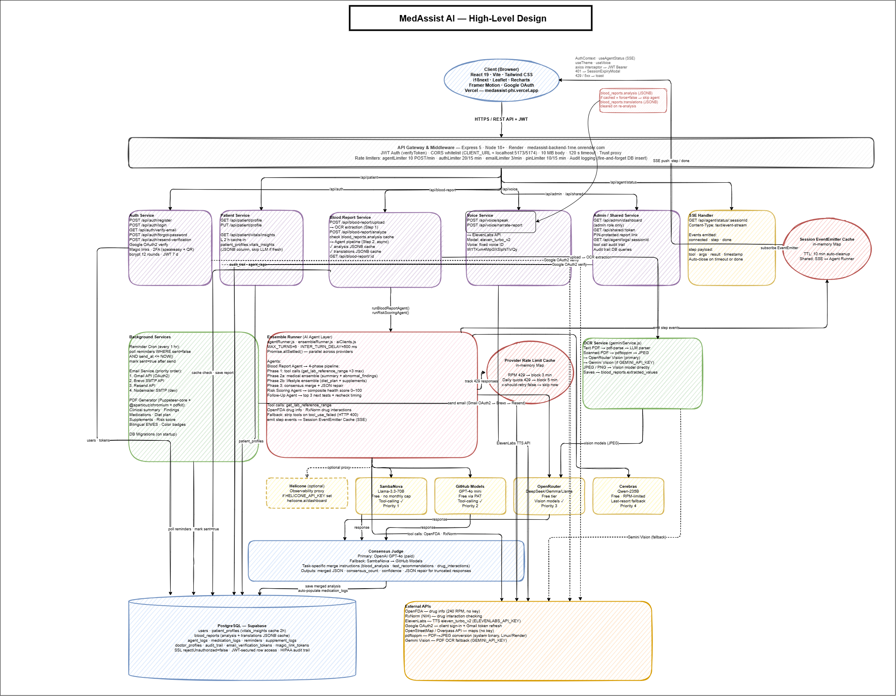](HLD_MedAssist_AI.drawio.png)

---

### Blood Report Processing Flow

```
  Patient uploads PDF / Image
           │
           ▼
  ┌─────────────────────┐
  │  Gemini Vision OCR  │  ← extracts 40+ blood parameters
  └──────────┬──────────┘
             │
             ▼
  ┌─────────────────────────────────────────────────────────┐
  │                  PHASE 1 — Tool Calls                    │
  │  OpenAI GPT-4o (dedicated)                              │
  │  → Fetch lab reference ranges from OpenFDA & RxNorm     │
  │    for top 3 abnormal parameters                        │
  └──────────────────────────┬──────────────────────────────┘
                             │
             ┌───────────────┴──────────────┐
             ▼                              ▼
  ┌─────────────────────────┐   ┌─────────────────────────────┐
  │  PHASE 2a — Medical      │   │  PHASE 2b — Lifestyle        │
  │  Ensemble (parallel)     │   │  Ensemble (parallel)         │
  │  SambaNova + GitHub +   │   │  SambaNova + GitHub +        │
  │  OpenRouter             │   │  OpenRouter                  │
  │  → Judge: OpenAI GPT-4o │   │  → Judge: OpenAI GPT-4o      │
  │                          │   │                              │
  │  Output:                 │   │  Output:                     │
  │  • summary               │   │  • diet_plan                 │
  │  • abnormal_findings     │   │  • recovery_ingredients      │
  │  • complexity_flag       │   │                              │
  │  • referral_needed       │   │                              │
  └──────────────┬──────────┘   └──────────────┬──────────────┘
                 │                              │
                 └──────────────┬───────────────┘
                                ▼
                 ┌──────────────────────────────┐
                 │   Merge → blood_reports DB    │
                 │   status: analyzed            │
                 └──────────────┬───────────────┘
                                │
              ┌─────────────────┼─────────────────┐
              ▼                 ▼                  ▼
  ┌───────────────────┐ ┌─────────────┐ ┌──────────────────┐
  │  Risk Scoring     │ │  Follow-Up  │ │  PDF / Summary   │
  │  Agent            │ │  Agent      │ │  Card Export     │
  │  0–100 composite  │ │  recheck    │ │  (Puppeteer)     │
  │  Framingham       │ │  schedule + │ │                  │
  │  FINDRISC         │ │  email      │ │                  │
  │  CKD-EPI          │ │  reminders  │ │                  │
  │  Child-Pugh       │ │             │ │                  │
  └───────────────────┘ └─────────────┘ └──────────────────┘
```

---

## Live Deployment

| Service | URL |
|---------|-----|
| Frontend (Vercel) | https://medassist-phi.vercel.app/ |
| Backend API (Render) | https://medassist-backend-1rne.onrender.com |

---

## Screenshots

### Authentication & Onboarding

| Login with Google OAuth | Welcome Email (New Account) |
|---|---|
| 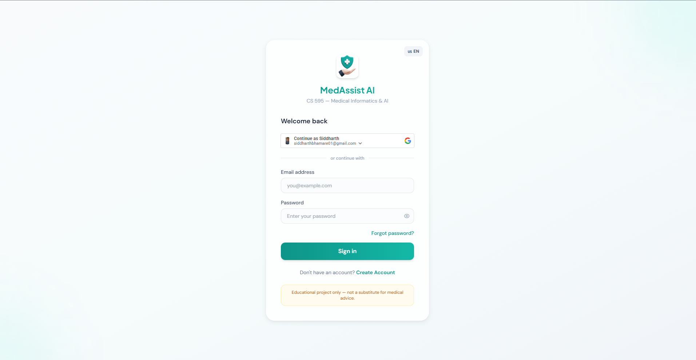 | 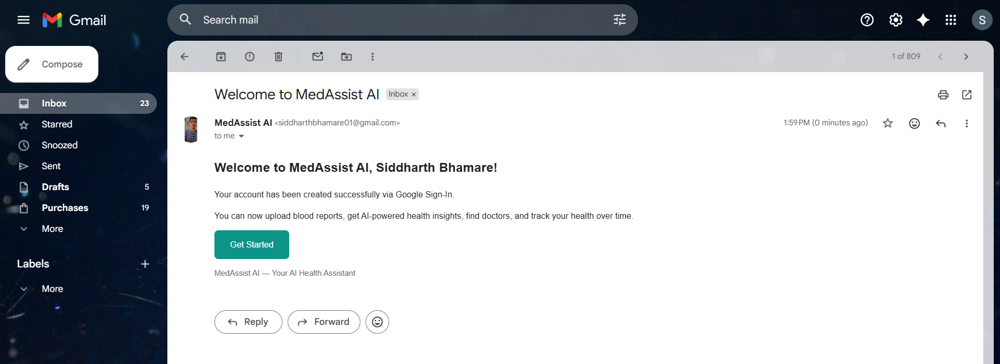 |

### Patient Dashboard

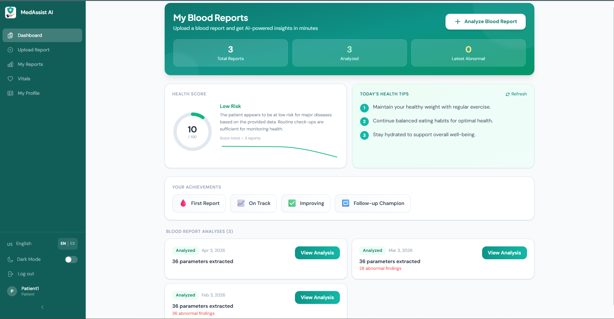

### Blood Report Upload

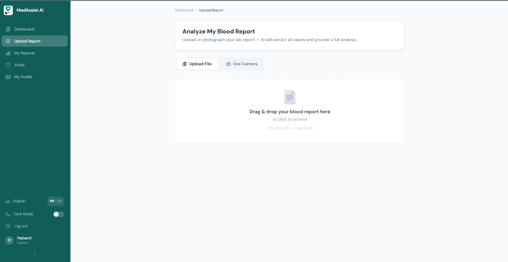

### AI Blood Report Analysis


### Report History & Side-by-Side Comparison

| My Reports & Parameter Trends | Report Comparison (Delta Badges) |
|---|---|
| 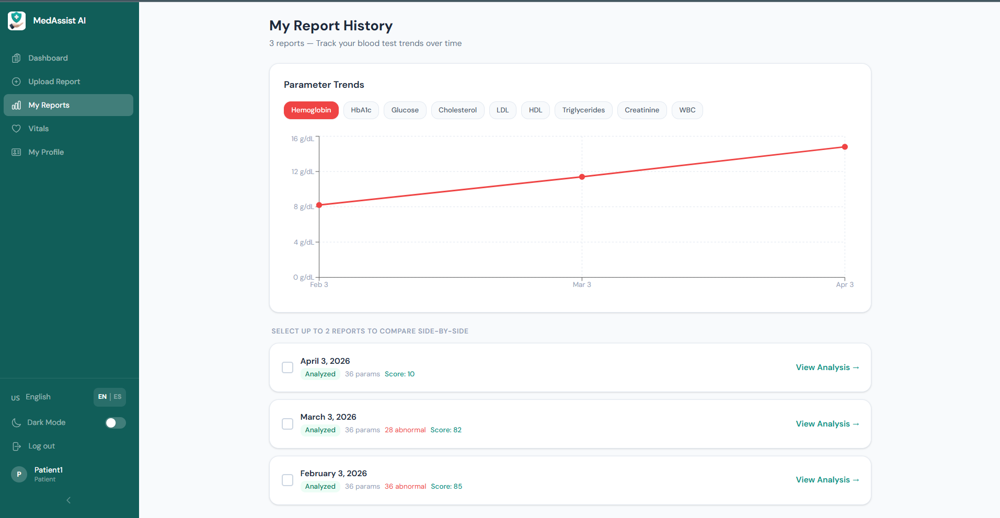 |  |

### Vitals Tracker

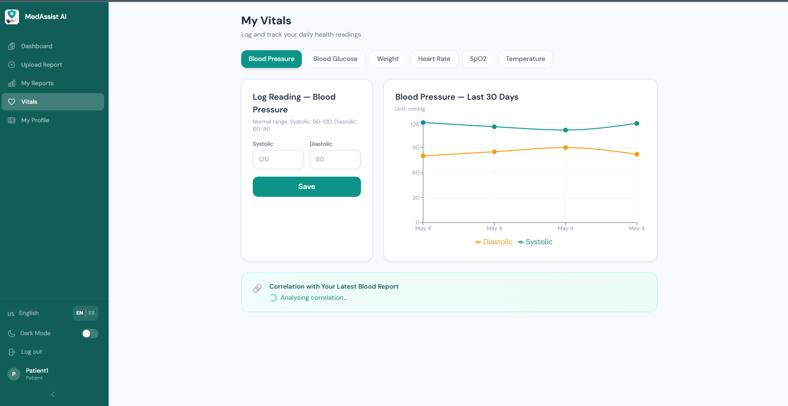

### Multi-Language Support (Spanish)

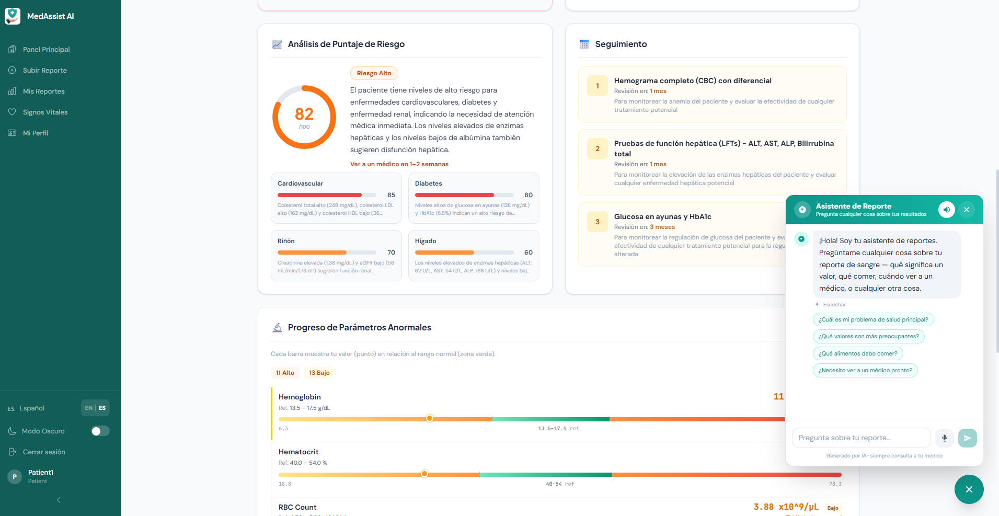

### AI Report Chatbot Assistant

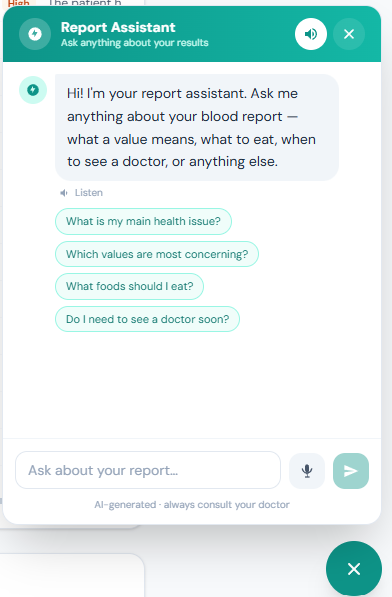

### Follow-Up Email Reminder

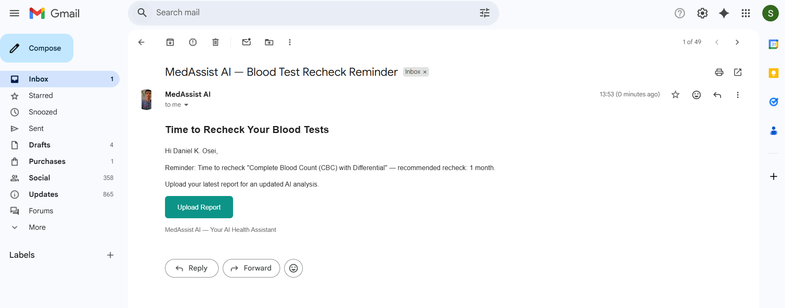

### Live Agent API Tracking & Backend Logs

| Agent API Calls (Langfuse) | Backend Server Logs (Render) |
|---|---|
| 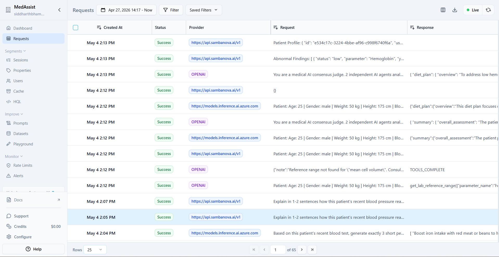 | 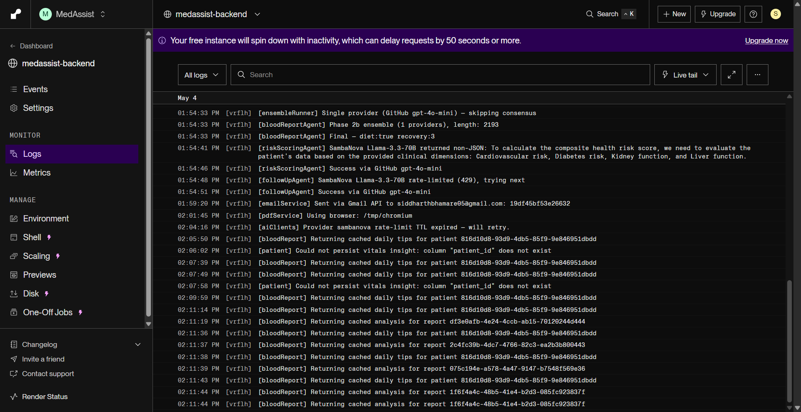 |

---

## Tech Stack

### Frontend
| Technology | Purpose |
|------------|---------|
| React 19 + Vite | SPA framework & build tool |
| Tailwind CSS | Utility-first styling with dark mode |
| React Router v7 | Client-side routing |
| Recharts | Trend charts & sparklines |
| Leaflet + React Leaflet | Interactive maps |
| Framer Motion | Page transitions & animations |
| react-hook-form | Form state management |
| i18next + react-i18next | English / Spanish i18n |
| Axios | HTTP client with JWT interceptor |
| @react-oauth/google | Google OAuth login |

### Backend
| Technology | Purpose |
|------------|---------|
| Node.js + Express 5 | REST API server |
| PostgreSQL (Supabase) | Primary database |
| JSON Web Tokens | Stateless authentication |
| bcryptjs | Password hashing |
| Speakeasy + QRCode | TOTP 2-factor authentication |
| Multer | File upload handling |
| PDFKit + Puppeteer Core | PDF generation & export |
| pdf-parse | Blood report PDF text extraction |
| Nodemailer | Email reminders & verification |
| express-rate-limit | API rate limiting (4 layers) |

### AI / External APIs
| API | Role |
|-----|------|
| **OpenAI GPT-4o** | Consensus judge + tool-calling (primary) |
| **SambaNova (Llama 3.3 70B)** | Ensemble agent — free tier |
| **GitHub Models (GPT-4o mini)** | Ensemble agent — free via GitHub PAT |
| **OpenRouter** | Ensemble agent — fallback model chain (Llama, DeepSeek, Gemma, Mistral) |
| **Google Gemini Vision** | Blood report OCR (image/PDF → 40+ parameters) |
| **ElevenLabs** | Text-to-speech report narration |
| **OpenFDA** | Drug information & adverse events |
| **RxNorm (NIH)** | Drug name normalization & interaction checking |
| **OpenStreetMap / Overpass API** | Nearby clinics, labs & hospitals search (10 km radius) |
| **Google OAuth** | Federated authentication |

---

## Project Structure

```
medassist/
├── client/                        # React + Vite frontend (Vercel)
│   └── src/
│       ├── pages/
│       │   ├── Auth/              # Login, Register, Reset Password, Email Verify
│       │   ├── Patient/           # Dashboard, Upload, Analysis, History, Vitals, Profile
│       │   ├── Shared/            # Public report view, Medical ID lookup
│       │   └── Admin/             # System stats, User management, Audit log
│       ├── components/            # HealthScoreCard, DailyTipsCard, AgentStatusPanel, Modals
│       ├── context/               # AuthContext, LanguageContext
│       ├── services/              # api.js (axios + JWT interceptor)
│       └── locales/               # en.json, es.json
│
└── server/                        # Express API (Render)
    ├── routes/                    # auth, patient, bloodReport, voice, admin, shared
    ├── agents/                    # bloodReportAgent, riskScoringAgent, followUpAgent
    │   └── tools/                 # medicalTools.js (lab ranges, drug lookups)
    ├── services/                  # geminiService, emailService, reminderService, pdfService
    ├── models/                    # patientQueries, User
    ├── middleware/                # auth (JWT verify), upload (Multer)
    └── db/                        # pool, schema.sql, migrate.js, migrations/
```

---

## Features

### Patient — Blood Report Upload

- Upload blood reports as image files (JPG/PNG) or PDF
- **Live camera capture mode** with guide-frame overlay, front/rear flip, and 2× resolution crop
- Google Gemini Vision extracts **40+ blood parameters** automatically

### Patient — AI Blood Report Analysis

The **Blood Report Agent** runs a 4-phase multi-LLM ensemble:

| Output | Details |
|--------|---------|
| Overall Assessment | 2–3 sentence summary with root cause identification |
| Abnormal Findings | Value, normal range, status (normal/low/high/critical), plain-English interpretation |
| Complexity Flag | Low / Medium / High with doctor referral decision |
| Diet Plan | Meal schedule + foods to eat/avoid |
| Recovery Ingredients | Natural supplements with targets & how-to-use |
| Tablet Recommendations | FDA-verified medication suggestions |

### Patient — Clinical Risk Scores

- **Framingham** cardiovascular risk
- **FINDRISC** diabetes risk
- **CKD-EPI** kidney function
- **Child-Pugh** liver function
- Composite health score (0–100) displayed as a gauge with sparkline trend

### Patient — Follow-Up Scheduling

- Top 3 recommended follow-up tests with recheck timeframes
  - Critical: 1–2 weeks · Significant: 1–3 months · Mild: 3–6 months
- Background email reminders 1 day before each scheduled recheck

### Patient — Report History & Trend Analysis

- Full report history with backdated monthly timestamps for demo
- Interactive trend charts for 10 key parameters across all visits
- Side-by-side comparison of any 2 reports with delta badges

### Patient — Audio Narration & Explanations

- Doctor-style text-to-speech narration via ElevenLabs
- Plain-English explanation of any abnormal finding on demand
- Native Spanish audio when language is set to Spanish

### Patient — Multi-Language Support

- Full English / Spanish UI powered by i18next
- Smart translation caching (stored in DB, incremental key updates)
- Poisoned-cache detection (prevents caching failed translations)
- One-click toggle in sidebar, persists across sessions

### Patient — Report Sharing & Export

- Generate PIN-protected shareable links (7-day expiry)
- Recipients view full report without an account
- Full analysis PDF export (multi-language)
- One-page summary card PDF

### Patient — Vitals Tracker

| Vital | Unit |
|-------|------|
| Blood Pressure | mmHg (systolic / diastolic) |
| Glucose | mg/dL |
| Weight | kg |
| Heart Rate | bpm |
| SpO₂ | % |
| Temperature | °F |

- 30-day trend charts per vital type
- AI-generated insights correlating vitals to blood report parameters

### Patient — Supplement Adherence

- Log daily intake of recommended recovery ingredients
- Streak tracking with consecutive-day counter
- Weekly adherence check notifications

### Patient — Medical ID (Emergency Card)

- Emergency contact name & phone, blood type, organ donor status, critical notes
- PIN-protected public lookup by patient ID
- Brute-force protection (10 attempts / 15 min per IP)

### Patient — Nearby Clinics & Labs

- Searches for doctors, clinics, hospitals, pharmacies, labs, and blood banks within **10 km** of the patient's location
- Powered by **OpenStreetMap Overpass API** with 3-mirror parallel fallback (14-second timeout per mirror)
- Results include: name, specialization, address, phone, website, and distance in km
- **1-hour in-memory cache** per location bucket (up to 200 cached queries) — cache hits bypass the API entirely
- Circuit breaker: 10-minute cooldown if all Overpass mirrors fail simultaneously

### Patient — Dashboard

- Health score card with AI summary and risk sparkline
- Daily personalized health tips (AI-generated, refreshable)
- Recent report cards with status, parameter count, abnormal findings
- Achievement badges (first report, analysis complete, streaks, etc.)

### Admin

- **System Statistics**: total users, blood reports, analyses generated
- **User Management**: paginated list with search, suspend/unsuspend
- **HIPAA Audit Trail**: full action log by user, action type, resource, and date range

---

## AI Agents

### Blood Report Agent
**`POST /api/blood-report/analyze`**

Four-phase execution with multi-LLM ensemble consensus:
1. **Tool phase** — fetch lab reference ranges from OpenFDA & RxNorm for top 3 abnormal parameters
2. **Medical section** — ensemble across providers → generates summary + abnormal findings
3. **Lifestyle section** — ensemble → generates diet plan + recovery ingredients
4. **Merge** — combines all outputs with graceful degradation on rate limits

Runs as a fire-and-forget background process; the client polls for completion.

### Risk Scoring Agent
**`POST /api/blood-report/risk-scores`**

Applies four validated clinical risk models (Framingham, FINDRISC, CKD-EPI, Child-Pugh) to extracted blood values, returning a composite 0–100 health score with per-domain breakdown.

### Follow-Up Agent
**`POST /api/blood-report/follow-up`**

Recommends the top 3 follow-up tests based on abnormal finding severity with evidence-based recheck timeframes. Automatically triggers the background email reminder scheduler.

### Ensemble Runner

All agents use a multi-provider consensus engine capped at **2 parallel providers** (to preserve free-tier quotas). The same prompt dispatches to SambaNova and GitHub Models simultaneously via `Promise.allSettled()`. **OpenAI GPT-4o** then acts as the consensus judge, merging all outputs into a single higher-accuracy result using task-specific merge strategies (blood_analysis · test_recommendations · drug_interactions). Rate-limit errors (429/503) trigger automatic fallback to the next provider in the priority chain.

---

## Ensemble Architecture

### Step 1 — Parallel Dispatch

```
                    ┌────────────────────────────────┐
                    │       Incoming LLM Request      │
                    └───────────────┬────────────────┘
                                    │ filter rate-limited providers
                    ┌───────────────┼───────────────┐
                    ▼               ▼               ▼
           ┌─────────────┐  ┌─────────────┐  ┌───────────────┐
           │  SambaNova  │  │   GitHub    │  │  OpenRouter   │
           │ Llama 3.3   │  │ GPT-4o mini │  │ DeepSeek /    │
           │   70B       │  │             │  │ Gemma / Llama │
           └──────┬──────┘  └──────┬──────┘  └──────┬────────┘
                  │                │                  │
                  └────────────────┼──────────────────┘
                                   │  Promise.allSettled()
                                   ▼
                    ┌──────────────────────────────┐
                    │     Collect Results (1+)      │
                    └──────────────┬───────────────┘
                                   │
                    ┌──────────────▼───────────────┐
                    │        Consensus Judge        │
                    │         OpenAI GPT-4o         │ ◄── fallback: SambaNova → GitHub
                    └──────────────┬───────────────┘
                                   │  merged JSON output
                                   ▼
                    ┌──────────────────────────────┐
                    │         Final Response        │
                    │   (higher accuracy result)    │
                    └──────────────────────────────┘
```

> If a provider is rate-limited (429/503), it is skipped automatically. The judge still produces a merged result from however many agents responded (minimum 1).

### Step 2 — Consensus Judge Merge Strategies

```
┌──────────────────────┬──────────────────────────────────────────────┐
│ Task                 │ Merge Strategy                               │
├──────────────────────┼──────────────────────────────────────────────┤
│ blood_analysis       │ Prefer conservative (lower/safer) values     │
├──────────────────────┼──────────────────────────────────────────────┤
│ test_recommendations │ Tests from 2+ agents → high priority         │
│                      │ Single-agent tests → lower urgency           │
├──────────────────────┼──────────────────────────────────────────────┤
│ treatment_plan       │ Prefer safer/lower doses; flag interactions   │
├──────────────────────┼──────────────────────────────────────────────┤
│ drug_interactions    │ Use MORE SEVERE rating when agents disagree   │
└──────────────────────┴──────────────────────────────────────────────┘
```

### AI Provider Roster

```
┌────────────────┬────────────────────┬──────────┬────────────────────────┐
│ Provider       │ Model              │ Cost     │ Role                   │
├────────────────┼────────────────────┼──────────┼────────────────────────┤
│ OpenAI         │ GPT-4o             │ Paid     │ Judge + tool-calling   │
│ SambaNova      │ Llama 3.3 70B      │ Free     │ Ensemble agent         │
│ GitHub Models  │ GPT-4o mini        │ Free*    │ Ensemble agent         │
│ OpenRouter     │ Multi-model chain  │ Free     │ Ensemble agent         │
└────────────────┴────────────────────┴──────────┴────────────────────────┘
* Free with a GitHub Personal Access Token (PAT)

OpenRouter fallback model chain (in order):
  DeepSeek Chat v3 → DeepSeek R1 → Gemma 3 27B → Mistral Nemo → Llama 3.1 8B
```

---

## Caching Layers

Cache hits avoid redundant API calls and improve response latency across the system.

```
┌─────────────────────────────────┬──────────┬────────────────────────────────┐
│ Cache Layer                     │ TTL      │ Storage                        │
├─────────────────────────────────┼──────────┼────────────────────────────────┤
│ Nearby clinics/labs (OSM)       │ 1 hour   │ In-memory (up to 200 buckets)  │
│ Report translations (ES)        │ Permanent│ PostgreSQL — blood_reports col  │
│ Daily health tips               │ 24 hours │ PostgreSQL — blood_reports col  │
│ Vitals AI insights              │ 2 hours  │ In-memory per patient + type    │
│ Rate-limit tracking (hard cap)  │ 5 min    │ In-memory — aiClients.js       │
│ Rate-limit tracking (RPM)       │ 3 min    │ In-memory — aiClients.js       │
└─────────────────────────────────┴──────────┴────────────────────────────────┘
```

---

## Database Schema

| Table | Purpose |
|-------|---------|
| `users` | Patient and admin accounts |
| `patient_profiles` | Health data (age, gender, conditions, allergies, medications, insurance) |
| `blood_reports` | Reports + full AI analysis, risk scores, follow-up, translations cache |
| `vitals_logs` | Daily vital sign history (BP, glucose, weight, HR, SpO₂, temperature) |
| `medication_logs` | Medication taken timestamps |
| `supplement_logs` | Supplement adherence streaks |
| `medical_id` | Emergency card (blood type, organ donor, PIN-protected) |
| `email_verification_tokens` | 24-hour email verification links |
| `password_reset_tokens` | 24-hour password reset tokens (one-time use) |
| `report_shares` | Shareable links with 7-day expiry + access tracking |
| `agent_logs` | AI agent execution audit (steps, turns, timing) |
| `audit_trail` | HIPAA action log (user, action, resource, IP, user-agent) |
| `reminders` | Scheduled follow-up email reminders |

---

## Authentication & Security

- **JWT** stateless authentication (7-day tokens)
- **Email verification** required on registration (24-hour link)
- **Password reset** via time-limited email token (one-time use)
- **Google OAuth** for passwordless / federated login
- **TOTP 2FA** compatible with Google Authenticator and Authy
- **Role-based access control**: `patient` · `admin`
- **Rate limiting** — 4 independent layers:
  - Auth: 20 req / 15 min / IP
  - Email: 3 req / 60 sec / IP
  - Agent: 10 req / 60 sec / IP
  - Medical ID PIN: 10 attempts / 15 min / IP
- **HIPAA audit trail** logs every sensitive action with IP and user-agent

---

## API Reference

| Group | Base Path | Key Endpoints |
|-------|-----------|---------------|
| Auth | `/api/auth` | register, login, google, forgot-password, verify-email, 2fa/setup |
| Patient | `/api/patient` | profile, vitals, vitals/insights, sessions, medical-id, badges |
| Blood Reports | `/api/blood-report` | upload, analyze, history, /:id, risk-scores, follow-up, export-pdf |
| Voice | `/api/voice` | speak, narrate-report, explain-finding, translate |
| Shared | `/api/shared` | share-report, shared/:token, medical-id/:patientId |
| Admin | `/api/admin` | stats, users, users/:id/suspend |
| Agent Status | `/api/agent` | status/:sessionId |

---

## Getting Started

### Prerequisites

- Node.js 18+
- PostgreSQL database (or a Supabase project)
- API keys: OpenAI (judge — required), Gemini (OCR — optional fallback), SambaNova + GitHub PAT + OpenRouter (ensemble agents — free), ElevenLabs (TTS — optional)

### 1. Clone & Install

```bash
git clone https://github.com/SiddharthBhamare01/medassist-ai.git
cd medassist-ai

cd server && npm install
cd ../client && npm install
```

### 2. Environment Variables

**`server/.env`**
```env
DATABASE_URL=postgresql://...
JWT_SECRET=your_jwt_secret

# AI — Judge (required)
OPENAI_API_KEY=your_openai_key

# AI — OCR (required)
GEMINI_API_KEY=your_gemini_key

# AI — Ensemble agents (free tier)
SAMBANOVA_API_KEY=your_sambanova_key
GITHUB_TOKEN=your_github_pat
OPENROUTER_API_KEY=your_openrouter_key

# Optional
ELEVENLABS_API_KEY=your_elevenlabs_key

GOOGLE_CLIENT_ID=your_google_client_id
GOOGLE_CLIENT_SECRET=your_google_secret

EMAIL_USER=your_gmail_address
EMAIL_PASS=your_gmail_app_password

CLIENT_URL=http://localhost:5173   # use https://medassist-phi.vercel.app/ in production
PORT=5000
```

**`client/.env`**
```env
VITE_API_URL=http://localhost:5000/api
VITE_GOOGLE_CLIENT_ID=your_google_client_id
```

### 3. Database Setup

Run in order in your Supabase SQL editor:

```
server/db/schema.sql
server/db/migrations/001_recommended_tests_jsonb.sql
server/db/migrations/002_session_status.sql
server/db/migrations/003_all_features.sql
server/db/migrations/004_persist_cached_llm_outputs.sql
server/db/seed.sql        # optional demo data
```

### 4. Run Locally

```bash
# Terminal 1 — backend
cd server && npm run dev

# Terminal 2 — frontend
cd client && npm run dev
```

Frontend: `http://localhost:5173` · Backend: `http://localhost:5000`

---

## Project Info

| | |
|-|-|
| **Course** | CS 595 — Medical Informatics & AI |
| **Institution** | Illinois Institute of Technology |
| **Developer** | Siddharth Bhamare |
| **Academic Year** | 2025–2026 |
